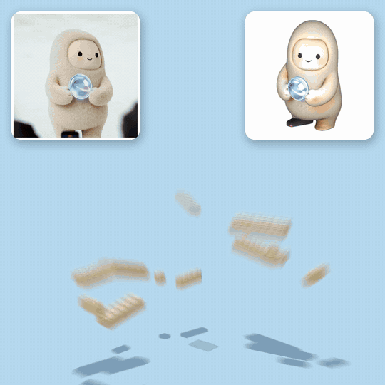

# brickify: any image → a LEGO model you can build

Send in a photo. Get back a LEGO model made of real parts: the LDraw file with build steps (opens in BrickLink Studio), the parts list with LEGO element numbers, the BrickLink wanted list to order everything, and an assembly clip like the ones below.

<p align="center"></p>

Inspired by [Victor Mustar's LEGO Microduck](https://x.com/victormustar/status/2103110908444631120), designed by Opus 5.5 from the robot's CAD. brickify does it for anything you have a picture of.

## how it works

1. **image → 3D.** Any image-to-3D model. We use [Hunyuan3D v3](https://fal.ai/models/fal-ai/hunyuan3d-v3/image-to-3d) on fal.ai: 38 cents and two minutes per mesh (`pipeline/image_to_3d.py`).
2. **3D → bricks** (`pipeline/brickify.py`). The shape is sampled at LEGO resolution, 8 mm studs and 3.2 mm plates, at whatever size you ask for. Every visible stud takes the closest real LEGO colour. Each layer is packed with real bricks and plates from a 28-size catalogue, orientation turned every layer so the seams overlap like a brick wall.
3. **verified before it exists.** Every part connects to the ground through stud contact; joints that only touch sideways, like arms or a held object, get a bridging plate laid across them. No two parts overlap. The centre of mass sits inside the footprint. Muse: 1,940 parts, 3,075 stud connections. Neo: 4,358 parts, 6,033 connections.
4. **outputs.** `model.ldr` with build steps (BrickLink Studio, LDCad, LeoCAD), `parts_list.csv` with LEGO element and BrickLink numbers, `bricklink_wanted.xml` to upload and order, `report.json` with every number.
5. **the clip.** A self-contained three.js page flies the parts in step by step (`pipeline/make_viewer.py`); a headless renderer with motion blur turns it into a 1080×1080 MP4 (`pipeline/render_video.js`).

## run it

```bash
pip install -r requirements.txt
# LDraw parts library (part shapes and colours, 150 MB): https://library.ldraw.org/library/updates/complete.zip
FAL_KEY=... python pipeline/image_to_3d.py --image photo.png --out out          # step 1, ~$0.38, ~2 min
python pipeline/brickify.py --glb out/photo.glb --height-mm 270 --out out --name thing \
  --colour-mode palette --gain 1.3 --interior dominant --ldconfig /path/to/ldraw/LDConfig.ldr
python pipeline/make_viewer.py --model out/thing_model.json --ldraw /path/to/ldraw --out out/thing_viewer.html
# optional MP4: npm i playwright && npx playwright install chromium
node pipeline/render_video.js file:///.../out/thing_viewer.html frames 30 6 0.7 && ffmpeg -framerate 30 -i frames/f%05d.png -c:v libx264 -pix_fmt yuv420p thing.mp4
```

`--height-mm` sets the real size. `--colour-mode palette` matches the texture to 37 LEGO colours; `--exclude` and `--gain` are your art direction. `--colour-mode muse` is the hand-designed face used for the Muse example.

## examples

| | Muse (Meta) | Neo (01Labs), the whole diorama |
|---|---|---|
| size | 176 × 272 × 176 mm | 224 × 262 × 200 mm |
| parts | 1,940 (818 bricks, 1,122 plates), 27 part types, 5 colours | 4,358 (1,209 bricks, 3,149 plates), 28 part types, 15 colours |
| stud connections | 3,075 | 6,033 |
| every part connected | yes | yes |
| centre of mass | inside the feet, 4.1 studs of margin | inside the footprint, 8.6 studs of margin |
| files | [examples/muse](examples/muse) | [examples/neo](examples/neo) |

Open the `.ldr` in BrickLink Studio, upload the wanted list to BrickLink, build.

## credits

Part shapes from the [LDraw parts library](https://www.ldraw.org) (CC BY 4.0); part and colour data conventions from [Rebrickable](https://rebrickable.com) and [BrickLink](https://www.bricklink.com). LEGO® is a trademark of the LEGO Group, which does not sponsor, authorize or endorse this project. Muse belongs to Meta. Neo belongs to 01Labs. Built in one evening with Claude Code.

## more research

https://01labs.ai/research
